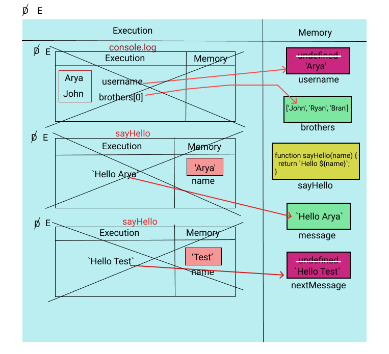
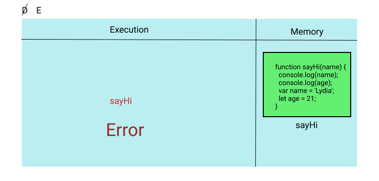

For the given code below:

- create the execution context diagram
- re-write the code in ways that system will understand/interprete

1.

```js
var username = 'Arya';
let brothers = ['John', 'Ryan', 'Bran'];

console.log(username, brothers[0]);

function sayHello(name) {
  return `Hello ${name}`;
}

let message = sayHello(username);
var nextMessage = sayHello('Test');
```
- System interpreted code

```js
// Declaration phase
var username = undefined;
let brothers;

function sayHello(name) {
  return `Hello ${name}`;
}

let message;
var nextMessage = undefined;

// Execution phase
username = 'Arya';
brothers = ['John', 'Ryan', 'Bran'];

console.log(username, brothers[0]);

message = sayHello(username);
nextMessage = sayHello('Test');
```



---

2.

```js
console.log(username, number);

var username = 'Arya';
let number = 21;

function sayHello(name) {
  return `Hello ${name}`;
}

let message = sayHello(username);
var nextMessage = sayHello('Test');
```
- System interpreted code

```js
// Declaration phase
var username = undefined;
let number;

function sayHello(name) {
  return `Hello ${name}`;
}

let message;
var nextMessage = undefined;

// Execution phase
console.log(username, number);

username = 'Arya';
number = 21;

message = sayHello(username);
nextMessage = sayHello('Test');
```


---

3.

```js
console.log(username, number);

let username = 'Arya';
let number = 21;

let sayHello = function (name) {
  return `Hello ${name}`;
};

let message = sayHello(username);
var nextMessage = sayHello('Test');
```

- System interpreted code

```js
// Declaration phase
let username = undefined;
let number;

let sayHello;

let message;
var nextMessage = undefined;

// Execution phase
console.log(username, number);

username = 'Arya';
number = 21;

sayHello = function (name) {
  return `Hello ${name}`;
};

message = sayHello(username);
nextMessage = sayHello('Test');
```


---

4.

```js
let username = 'Arya';
console.log(username, number);

let number = 21;
let message = sayHello(username);

let sayHello = function (name) {
  return `Hello ${name}`;
};

var nextMessage = sayHello('Test');
```

- System interpreted code

```js
// Declaration phase
let username;

let number;
let message;

let sayHello;

var nextMessage = undefined;

// Execution phase
username = 'Arya';
console.log(username, number);

number = 21;
message = sayHello(username);

sayHello = function (name) {
  return `Hello ${name}`;
};

nextMessage = sayHello('Test');
```


---

5.

```js
console.log(name);
console.log(age);
var name = 'Lydia';
let age = 21;
```

- System interpreted code

```js
// Declaration phase
var name = undefined;
let age;

// Execution phase
console.log(name);
console.log(age);
name = 'Lydia';
age = 21;
```


---

6.

```js
function sayHi(name) {
  console.log(name);
  console.log(age);
  var name = 'Lydia';
  let age = 21;
}

sayHi();
```

- System interpreted code

```js
// Declaration phase
function sayHi(name) {
  // Declaration phase
  var name = undefined;
  let age;
  // Execution phase
  console.log(name);
  console.log(age);
  name = 'Lydia';
  age = 21;
}

// Execution phase
sayHi();
```


---

6.

```js
sayHi();
function sayHi(name) {
  console.log(name);
  console.log(age);
  var name = 'Lydia';
  let age = 21;
}
```

- System interpreted code

```js
// Declaration phase
function sayHi(name) {
  // Declaration phase
  var name = undefined;
  let age;
  // Execution phase
  console.log(name);
  console.log(age);
  name = 'Lydia';
  age = 21;
}

// Execution phase
sayHi();
```


---

7.

```js
sayHi();
let sayHi = function sayHi(name) {
  console.log(name);
  console.log(age);
  var name = 'Lydia';
  let age = 21;
};
```

- System interpreted code

```js
// Declaration phase
let sayHi;

// Execution phase
sayHi();
sayHi = function sayHi(name) {
  console.log(name);
  console.log(age);
  var name = 'Lydia';
  let age = 21;
};
```



---

8.

```js
let num1 = 21;
console.log(sum);
var sum = num1 + num2;
let num2 = 30;
```

- System interpreted code

```js
// Declaration phase
let num1;
var sum = undefined;
let num2;

// Execution phase
num1 = 21;
console.log(sum);
sum = num1 + num2;
num2 = 30;
```


---

9.

```js
var num1 = 21;

let sum2 = addAgain(num1, num2, 4, 5, 6);

let add = (a, b, c, d, e) => {
  return a + b + c + d + e;
};
function addAgain(a, b) {
  return a + b;
}
let num2 = 200;

let sum = add(num1, num2, 4, 5, 6);
```

- System interpreted code

```js
// Declaration phase
var num1 = undefined;

let sum2;

let add;
function addAgain(a, b) {
  return a + b;
}
let num2;

let sum;

// Execution phase
num1 = 21;

sum2 = addAgain(num1, num2, 4, 5, 6);

add = (a, b, c, d, e) => {
  return a + b + c + d + e;
};

num2 = 200;

sum = add(num1, num2, 4, 5, 6);
```


---

10.

```js
function test(a) {
  let num1 = 21;
  return add(a, num1);
}

let sum = test(100);

let add = (a, b) => {
  return a + b;
};
```

- System interpreted code

```js
// Declaration phase
function test(a) {
  let num1;
  num1 = 21;
  return add(a, num1);
}

let sum;
let add;

// Execution phase
sum = test(100);

add = (a, b) => {
  return a + b;
};
```


---

11.

```js
function test(a) {
  let num1 = 21;
  return add(a, num1);
}

let sum = test(100);

function add(a, b) {
  return a + b;
}
```

- System interpreted code

```js
// Declaration phase
function test(a) {
  let num1;
  num1 = 21;
  return add(a, num1);
}

let sum;

function add(a, b) {
  return a + b;
}

// Execution phase
sum = test(100);
```

